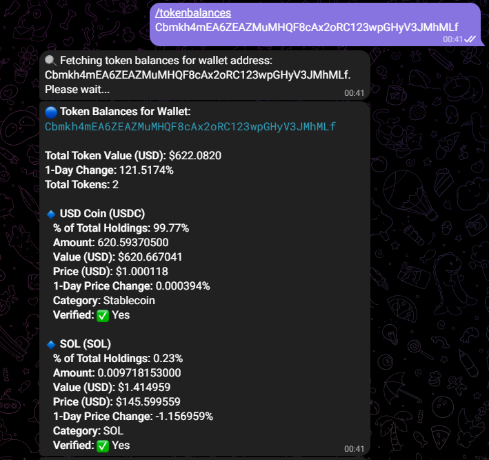
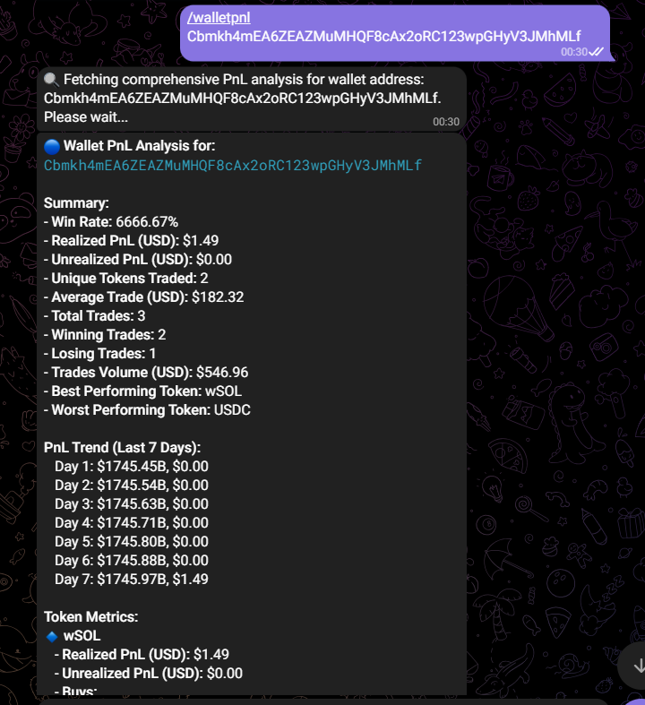
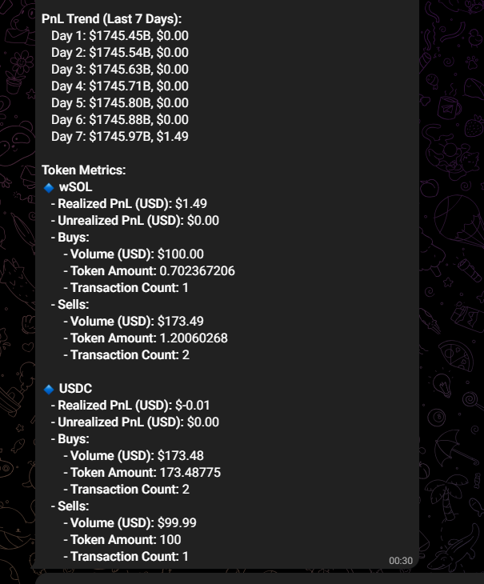
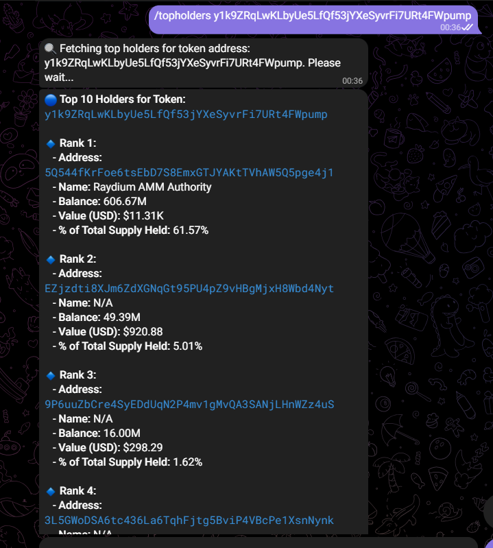
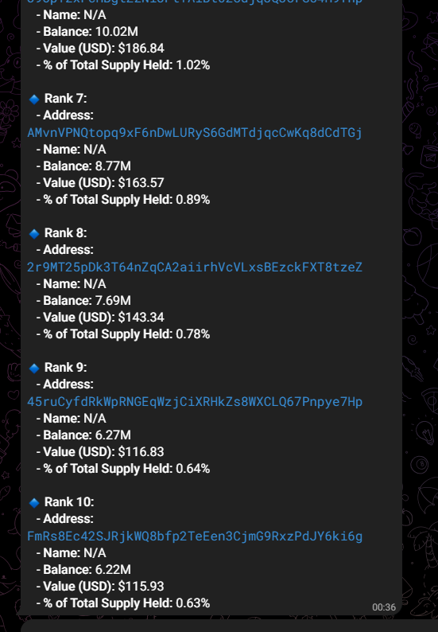
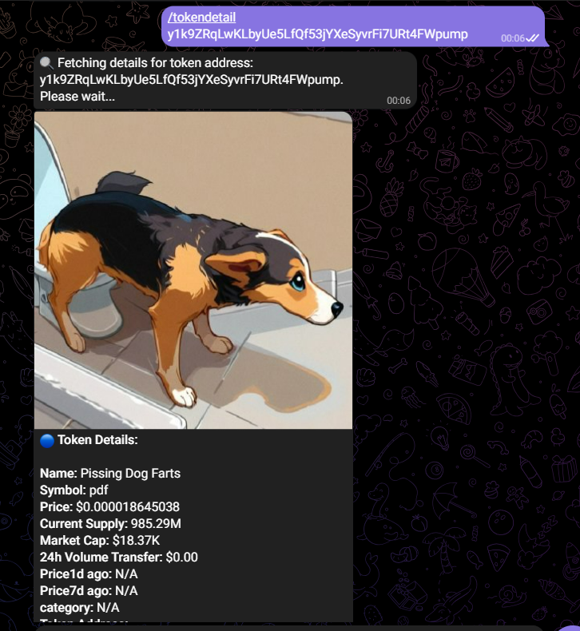
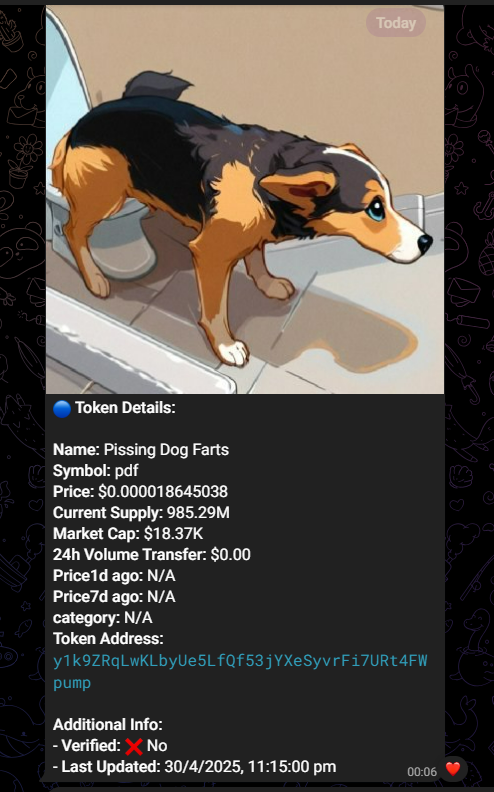
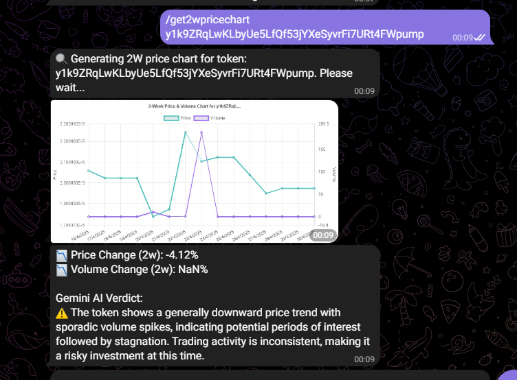

# 📡 Vybe Telegram Bot

An innovative Telegram bot that delivers **real-time, on-chain analytics** to crypto communities—think wallet tracking, token metrics, or whale alerts—all powered by [Vybe APIs](https://vybe.network).


## 🌐 Live Demo

🎥 **Watch Demo on Google Drive**  
[Click here to watch the demo](https://drive.google.com/file/d/1EqaISerchsaRqhhVY7kZa2gSWGThH_XD/view?usp=sharing)
 
## ✨ Features

- 📈 **Token Metrics** — Get detailed token info with a simple command.
- 👛 **Wallet Balances** — Check what any wallet is holding.
- 📊 **Wallet PnL Analysis** — Analyze profit/loss across trades.
- 🔔 Perfect for crypto communities, degens, and analysts alike.


## 🛠 Tech Stack

- **Language:** TypeScript  
- **Server:** Express.js  
- **Bot Framework:** [node-telegram-bot-api](https://github.com/yagop/node-telegram-bot-api)  
- **Infra:** AWS EC2 (for high performance deployment)  
- **API:** Vybe Network


## 💬 Commands

```bash
/start
  Initiates interaction with the bot

/help
  Shows available commands

/tokendetail <token_address>
  Get token details for a given token address

/tokenbalances <wallet_address>
  View all token balances for a wallet address

/walletpnl <wallet_address>
  Analyze wallet trading PnL (profit and loss) for a wallet address

/topholders <token_address>
  Get top holders of a token by token address

/get2wpricechart <token_address>
  Get 2-week price and volume chart for a token address

```

## 🚀 Getting Started

1. **Clone the Repo**
```bash
git clone https://github.com/your-username/Vybe-tgbot.git
cd Vybe-tgbot
```

2. **Install Dependencies**
```bash
npm install
```

3. **Set Up Environment Variables**
Create a `.env` file in the root directory and add:
```ini
BOT_TOKEN=your-telegram-bot-token
API_TOKEN=your-vybe-api-token
GEMINI_API_TOKEN=your-gemini-token
```

4. **Build and Run the Bot**
```bash
npm run build
npm run start
```

## 📸 Screenshots

| Command         | Output(s)                                                                                                 |
|-----------------|----------------------------------------------------------------------------------------------------------|
| `/tokenbalances`|                                                                     |
| `/walletpnl`    |                                        |
| `/topholders`    |                                        |
| `/tokendetail`  |                                    |
| `/get2wpricechart`|  |

## 🤝 Contributing

We welcome PRs and contributions! Just follow these general rules:

- ✅ Follow conventional code style and naming.
- 🧪 Test your changes locally.
- 📄 Open an issue before big features.

<!-- ## 📄 License

MIT © Your Name -->

## 🌐 Live Bot

🟢 Bot is live! Find it on Telegram at @Vybe_tgbot
